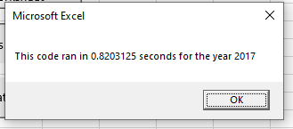
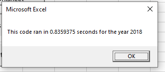
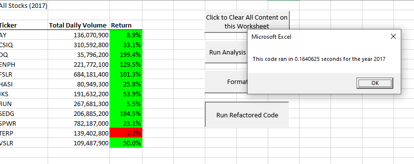
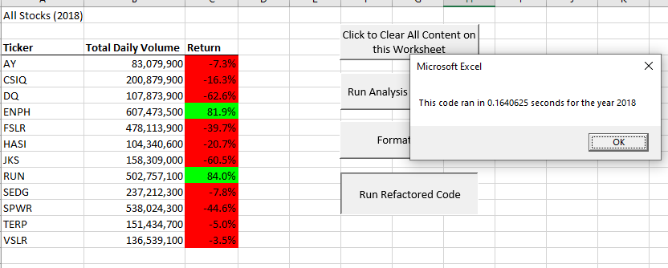

# stock-analysis
Performing analysis on stock data to uncover trends

## Overview of Project
1. Create interactive and user friendly Excel workbook that analyze stocks dataset (2017 and 2018) using VBA code to help answer questions about specific stocks performance. End user is able to chose which year should be analyzed - 2017 or 2018.
2. Measure run time of VBA code using nested loops and compare it to run time of refactored VBA code that ensures to loop through all the data one time in order to collect the same information as the original VBA code. The end goal is to determine whether refactoring made the VBA script run faster.

## Results

### Analysis Source File

The interactive Excel workbook can be viewed here [VBA Challenge](VBA_Challenge.xlsm)

### Run Time of VBA Code using Nested Loops

Analysing 2018 stocks data (original VBA code run time):

Analysing 2018 stocks data (original VBA code run time):

---
### Run Time of Refactored VBA Code

Analyzing 2017 stocks data (refactored VBA code run time):

Analyzing 2018 stocks data (refactored VBA code run time):

  
---
### Challenges and Difficulties Encountered
Possible challenges could arise if we tried to do deeper dive to understand why some campaigns failed while others were successful. Also trying to understand why campaings were canceled would be difficult as there is no reason for cancellation.

## Summary

- What are two conclusions you can draw about the Outcomes based on Launch Date?

   *1. The most number of successful kickstarter campaings in the theater category have been launched in May.*
   
   *2. The least successful month to launch a kickstarter campaign in the theater category seems to be December.*

- What can you conclude about the Outcomes based on Goals?

  *The highest number of kickstarter projects under plays subcategory (534) had a goal between 1000 and 4999 and 73% (388) of these kickstarter projects have been successful.
  Total of 16 kickstarter projects under plays subcategory had goal greater than 50000 and 88% (14) of these kickstarter projects failed.*
  
- What are some limitations of this dataset?

  *This dataset is missing columns description. 
  This dataset does not provide any other variables that would provide a deeper dive into reasons why particular campaign was or was not successful. More data should be collected to better understand why campaign has failed. It might be a good idea to collect: reason for cancellation, donation type/method, crowdfunding method/site, etc.*

- What are some other possible tables and/or graphs that we could create?

  *We could look at average donation by category and subcategory and/or by outcome.
  We could look at average campaing time of successful campaigns by category/subcategory and/or by goal ranges.
  We could look at the average number of backers by category/subcategory and/or by month.*
